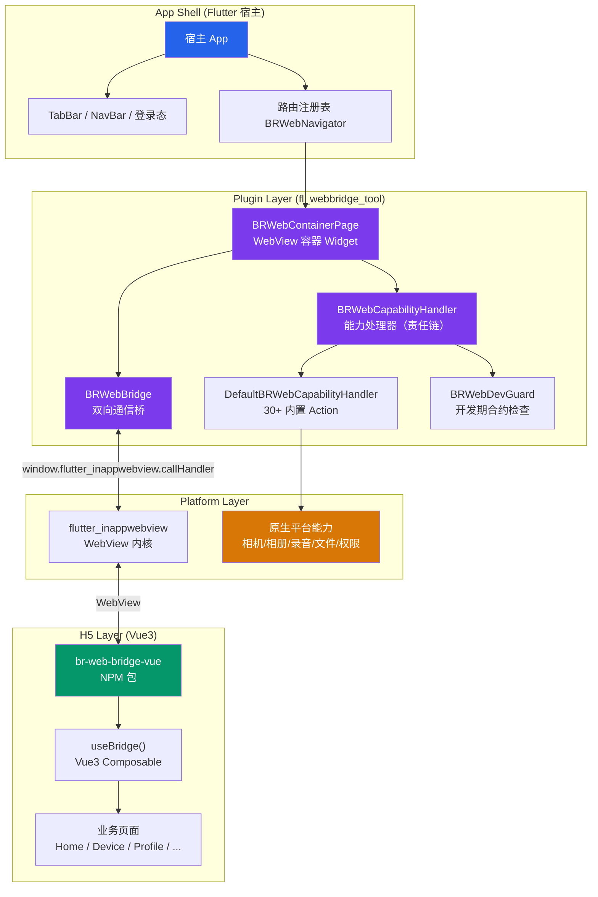
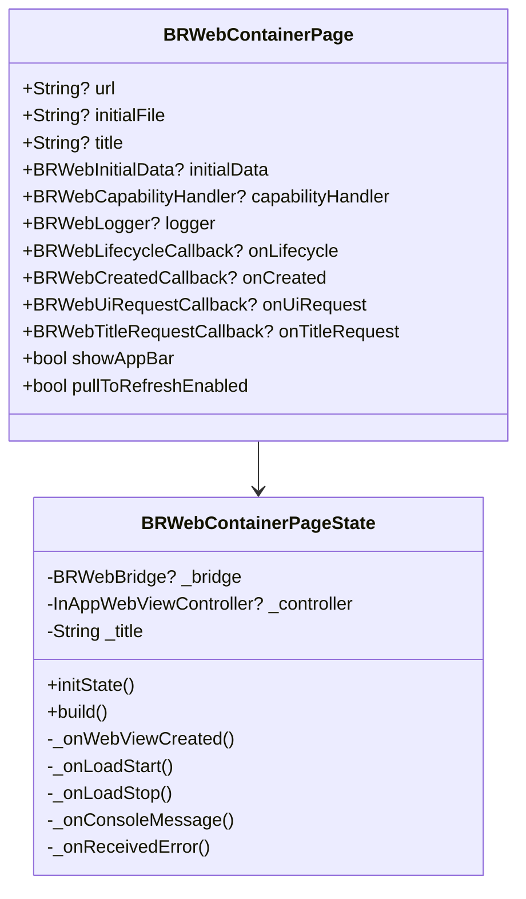
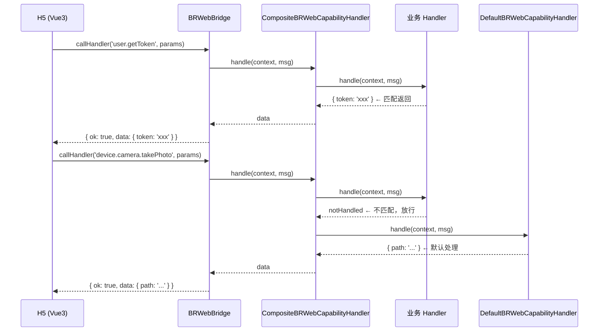
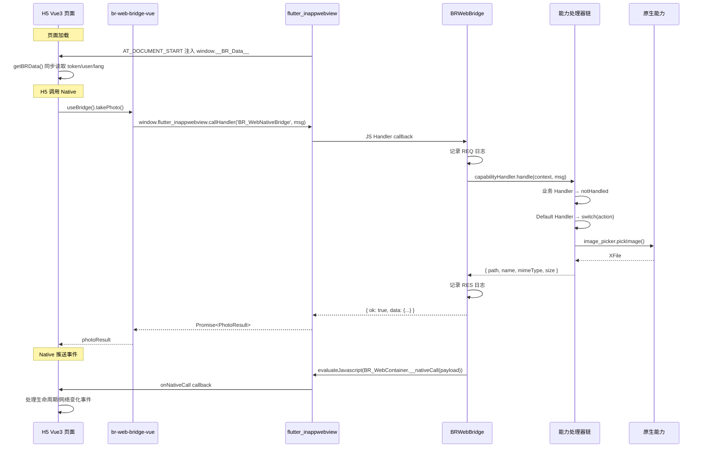

# fl_webbridge_tool — 技术设计文档

> **一句话定位**：Flutter 做壳 + H5 做业务，统一 Bridge 双向通信的通用插件框架。
>
> 适用场景：App 壳（导航、TabBar、登录态、权限、原生能力）+ H5 高频变化的页面业务。

---

## 目录

1. [项目概况](#1-项目概况)
2. [总体架构](#2-总体架构)
3. [分层架构](#3-分层架构)
4. [Bridge 通信协议](#4-bridge-通信协议)
5. [核心组件详解](#5-核心组件详解)
6. [完整能力矩阵](#6-完整能力矩阵)
7. [Vue3 SDK 集成](#7-vue3-sdk-集成)
8. [数据流](#8-数据流)
9. [扩展机制](#9-扩展机制)
10. [设计决策与踩坑记录](#10-设计决策与踩坑记录)

---

## 1. 项目概况

| 属性 | 说明 |
|------|------|
| 名称 | `fl_webbridge_tool` |
| 类型 | Flutter Plugin（Android + iOS） |
| 语言 | Dart (Flutter) + TypeScript (Vue3 SDK) + Swift/Kotlin (平台层) |
| 核心依赖 | `flutter_inappwebview` 6.1.x |
| SDK 版本 | Dart 3.11+ / Flutter 3.24+ |
| 平台支持 | Android / iOS / Web / Windows / macOS |

**核心理念**：
- **Native 管容器，H5 管内容**：TabBar / NavBar / Title / 路由由 Flutter 原生层控制，H5 通过 Bridge 提需求
- **默认能力开箱可用，业务可按需扩展**

---

## 2. 总体架构



---

## 3. 分层架构

```
┌──────────────────────────────────────────────────────┐
│                   宿主 App 层                          │
│  TabBar / NavBar / 登录态 / 路由 / 全局日志             │
├──────────────────────────────────────────────────────┤
│                 Plugin 公共 API 层                     │
│  fl_webbridge_tool.dart (16 个公开 export)            │
├──────────────────────────────────────────────────────┤
│                   容器 & 通信层                        │
│  BRWebContainerPage  BRWebBridge  BRWebNavigator     │
├──────────────────────────────────────────────────────┤
│                   能力处理层（责任链）                   │
│  BRWebCapabilityHandler → CompositeBRWebCapabilityHandler│
│  ├── 业务自定义 Handler（优先匹配）                     │
│  └── DefaultBRWebCapabilityHandler（兜底 30+ action）  │
├──────────────────────────────────────────────────────┤
│                   基础服务层                            │
│  Logger │ Permission │ Network │ DB │ Resource │ Lifecycle│
├──────────────────────────────────────────────────────┤
│                   平台桥接层                            │
│  flutter_inappwebview │ image_picker │ record │ sqflite│
│  path_provider │ file_picker │ ...                     │
├──────────────────────────────────────────────────────┤
│                  iOS / Android 原生                     │
│  Swift Plugin │ Kotlin Plugin                        │
└──────────────────────────────────────────────────────┘

┌──────────────────────────────────────────────────────┐
│                    H5 层 (Vue3)                       │
│  br-web-bridge-vue NPM 包                             │
│  ├── bridge.ts    (底层 brCall / getBRData)           │
│  ├── useBridge.ts (Vue3 Composable)                   │
│  ├── plugin.ts    (Vue Plugin)                        │
│  └── types.ts     (TS 类型定义)                        │
├──────────────────────────────────────────────────────┤
│                  Vue3 业务页面                          │
│  Home / Device / Profile / WorkOrders / Resource ...  │
└──────────────────────────────────────────────────────┘
```

---

## 4. Bridge 通信协议

### 4.1 H5 → Native（统一消息模型）

```js
window.flutter_inappwebview.callHandler('BR_WebNativeBridge', {
  id: 'req_1712345678_abc',
  action: 'device.camera.takePhoto',
  params: { quality: 80, maxWidth: 1600, saveToGallery: true },
  meta: { h5Version: '2.0.1', platform: 'ios', appVersion: '1.0.0' } // 自动注入
})
```

### 4.2 Native 响应

```json
// ✅ 成功
{ "id": "req_1712345678_abc","action":"xxxx","ok": true, "data": { "path": "/tmp/xxx.jpg" } }

// ❌ 失败
{ "id": "req_1712345678_abc","action":"xxx", "ok": false, "error": "permission_denied" }
```

### 4.3 Native → H5（统一格式，双向一致）

```dart
// Dart — 与 H5→Native 相同 {id, action, params} 格式
BRWebBridge.callWeb('container.lifecycle', { type: 'loadStop', url: '...' });
// → 发送 { id: "n_xxx", action: "container.lifecycle", params: {...} }
```

H5 侧注册 + 可回传响应：
```ts
import { onNativeCall, setBridgeMeta } from 'br-web-bridge-vue'

onNativeCall((msg) => {
  // msg: { id, action, params, meta? } — 与 H5→Native 完全相同
  if (msg.action === 'container.lifecycle') handleLifecycle(msg.params)
  return { ok: true, data: {} } // 可选回传
})

// 每次 brCall 自动携带的 meta 可扩展
setBridgeMeta({ userId: '1001', role: 'admin' })
```

### 4.4 Action 命名规范

```
namespace.entity.verb

device.camera.takePhoto
device.camera.pickPhoto
device.camera.pickMultiPhoto
device.camera.takeVideo
device.camera.pickVideo
device.file.pick
device.file.preview
device.file.previewMulti
device.file.delete
device.file.readAsDataUrl
device.network.status
device.system.info
device.audio.startRecord
device.audio.stopRecord
navigation.navigateTo
navigation.goBack
navigation.setTitle
ui.hideTabBar
ui.showTabBar
resource.getStatus / checkUpdate / startUpdate / cancelUpdate / switchTo
database.workOrder.query / getById / insert / update / delete
container.close
```

---

## 5. 核心组件详解

### 5.1 BRWebContainerPage — WebView 容器 Widget



**关键设计**：
- **双模式加载**：`url`（远程 HTTP/HTTPS）或 `initialFile`（本地 asset 或绝对文件路径）
- **数据注入时机**：`initialUserScripts AT_DOCUMENT_START` 保证在所有 JS 之前执行（**非** `evaluateJavascript` fire-and-forget）
- **SPA 路由兼容**：`onLoadStart` 中补充注入 `window.__BR_Data__`，处理 Vue Router 页面切换

### 5.2 BRWebBridge — 双向通信桥

```dart
class BRWebBridge {
  static const handlerName = 'BR_WebNativeBridge';

  void bind(InAppWebViewController controller);  // 注册 JS Handler（H5→Native）
  Future callWeb(String action, Map params);     // 调用 H5（Native→H5，统一格式）
  Future emitLifecycle(String type, Map data);   // 推送生命周期事件
}
```

**通信流程**：
```
H5: callHandler('BR_WebNativeBridge', msg)
  → BRWebBridge.bind() callback
  → capabilityHandler.handle(context, msg)
  → try { return message.ok(data) } catch { return message.fail(error) }
  → 日志记录：bridgeRequest → bridgeResponse + bridgeError（含堆栈）
  → 返回给 H5
```

### 5.3 BRWebCapabilityHandler — 能力处理器（责任链模式）



```dart
abstract interface class BRWebCapabilityHandler {
  Future<Object?> handle(BuildContext context, BRWebBridgeMessage message);
}

// 组合多个 handler——业务优先，默认兜底
BRWebContainerPage(
  capabilityHandler: CompositeBRWebCapabilityHandler([
    AppCapabilityHandler(),         // 业务自定义——匹配到就返回
    DefaultBRWebCapabilityHandler(), // 默认实现——30+ action 兜底
  ]),
)
```

### 5.4 BRWebDevGuard — 开发期合约检查

```dart
BRWebContainerPage(
  capabilityHandler: BRWebDevGuard(
    inner: myHandler,
    logger: _logger,
    expectedUiActions: ['hideTabBar', 'showTabBar'],
  ),
  // ← 如果忘了绑 onUiRequest，H5 调 ui.hideTabBar 时打印 ⚠️ 警告
)
```

- Debug 模式下自动检测回调绑定完整性
- H5 调了 UI action 但 Native 没绑 `onUiRequest` → 立即打印 ⚠️ 警告

### 5.5 BRWebLogger — 全链路日志

| 图标 | 类型 | 来源 |
|------|------|------|
| 📡 | lifecycle | WebView 容器（created/loadStart/loadStop/progress/titleChanged） |
| ⬆️ REQ | request | H5 → Native bridge 请求 |
| ⬇️ RES | response | Native → H5 bridge 响应 |
| 📜 | console | H5 `console.log/error/warn` |
| 💥 | error | H5 JS 运行时错误（`onReceivedError`） |
| 🎨 UI | ui | H5 请求控制原生 UI（hideTabBar/showTabBar） |
| 🦴 | native | 业务层自定义日志 |
| 🔌 | bridgeError | bridge 通信异常（含 StackTrace） |

```dart
// Callback 模式——接入任意 UI
final logger = CallbackBRWebLogger(onLog: (entry) => logPage.add(entry.toString()));

// 全局单例——任意位置写入/订阅
BRWebGlobalLog.log(msg);
BRWebGlobalLog.adapter;  // 用作 BRWebLogger 兼容适配器
```

### 5.6 BRWebNavigator — 路由注册表

```dart
// 注册 WebView 路由
BRWebNavigator.register('/h1', BRWebRouteConfig(url: 'https://domain.com/h1', title: '首页'));
BRWebNavigator.register('/demo', BRWebRouteConfig(initialFile: 'assets/h5/demo.html', title: 'Demo'));

// 注册原生页面路由
BRWebNavigator.registerNative('/login', (ctx, params) => LoginPage());

// 推入页面
BRWebNavigator.push(context, '/h1', params: {'id': '123'});
BRWebNavigator.pop(context);
```

### 5.7 BRWebInitialData — 同步数据注入

```dart
BRWebContainerPage(
  initialData: BRWebInitialData(
    accessToken: 'eyJ...',
    userData: {'id': '1001', 'name': '张三'},
    lang: 'zh-CN',
    extra: {'appVersion': '1.2.3'},
  ),
)
```

H5 无需 bridge 调用，同步读取：
```ts
import { getBRData } from 'br-web-bridge-vue'

const { accessToken, user, lang, appVersion, extra } = getBRData()
// TypeScript 类型：BRWebInitialData
// { accessToken?, user?, lang?, appVersion?, resourceVersion?, extra?, [key: string]: unknown }
```

**注入方式**：`initialUserScripts AT_DOCUMENT_START` + `onLoadStart` 补充注入（SPA 兼容）。

### 5.8 BRWebPermissionHelper — 统一权限

三步策略：
```
已授予 → 直接通过 ✅
普通拒绝 → 弹出说明弹窗 → 重试 🔄
永久拒绝 → 弹出引导弹窗 → 跳转系统设置 ⚙️
拒绝时不抛错，返回 { cancelled: true, reason: 'permission_denied' }
```

---

## 6. 完整能力矩阵

### 设备能力（DefaultBRWebCapabilityHandler）

| Action | 说明 | 权限 | 关键参数 |
|--------|------|------|---------|
| `device.camera.takePhoto` | 拍照 | `CAMERA` | `quality`, `maxWidth`, `maxSizeKB`, `saveToGallery` |
| `device.camera.pickPhoto` | 相册选图 | `PHOTOS` | `maxSizeKB` |
| `device.camera.pickMultiPhoto` | 相册多选 | `PHOTOS` | `maxCount` |
| `device.camera.takeVideo` | 录像 | `CAMERA`+`MIC` | `maxDuration`, `saveToGallery` |
| `device.camera.pickVideo` | 相册选视频 | `PHOTOS` | `maxDuration` |
| `device.file.pick` | 选择文件 | - | `multiple` |
| `device.file.preview` | 预览文件 | - | `path`, `type`, `title` |
| `device.file.previewMulti` | 多文件滑动预览 | - | `files[]`, `index` |
| `device.file.delete` | 删除本地文件 | - | `path` |
| `device.file.readAsDataUrl` | 读文件为 base64 | - | `path` |
| `device.audio.startRecord` | 开始录音 | `MICROPHONE` | - |
| `device.audio.stopRecord` | 停止录音 | - | - |
| `device.network.status` | 网络状态 | - | 返回 `wifi/mobile/offline` |
| `device.system.info` | 系统信息 | - | 设备型号/系统版本/App版本 |

### 导航 & UI

| Action | 说明 | 参数 |
|--------|------|------|
| `navigation.navigateTo` | 跳转注册路由 | `route`, `params` |
| `navigation.goBack` | 返回 | - |
| `navigation.setTitle` | 修改标题 | `title` |
| `ui.hideTabBar` | 隐藏 TabBar | - |
| `ui.showTabBar` | 显示 TabBar | - |
| `container.close` | 关闭容器 | `reason` |

### 离线资源包（BRWebResourceManager）

| Action | 说明 |
|--------|------|
| `resource.getStatus` | 获取资源状态（版本/进度/已安装） |
| `resource.checkUpdate` | 检查服务端新版本 |
| `resource.startUpdate` | 开始下载 |
| `resource.cancelUpdate` | 取消下载 |
| `resource.switchTo` | 切换到指定版本 |

### 数据库（NativeDataBaseManager<T>）

| Action | 说明 |
|--------|------|
| `database.workOrder.query` | 条件查询 |
| `database.workOrder.getById` | 单条查询 |
| `database.workOrder.insert` | 插入 |
| `database.workOrder.update` | 更新 |
| `database.workOrder.delete` | 删除 |

---

## 7. Vue3 SDK 集成

### 7.1 NPM 包结构

```
packages/br-web-bridge-vue/
├── package.json          # peerDependencies: vue ^3.4+
├── README.md
└── src/
    ├── index.ts          # 统一导出
    ├── bridge.ts         # 底层 API: brCall / getBRData / waitForBridge / onNativeCall
    ├── useBridge.ts      # Vue3 Composable
    ├── plugin.ts         # Vue Plugin: app.use(BRWebBridgePlugin)
    └── types.ts          # TS 类型定义（PhotoResult / VideoResult / SystemInfo / ...）
```

### 7.2 接入方式

```ts
// 方式 1：Vue3 Composable（推荐）
import { useBridge, getBRData } from 'br-web-bridge-vue'

const { takePhoto, navigateTo, hideTabBar } = useBridge()
const { accessToken, user } = getBRData()

// 方式 2：底层 API
import { brCall } from 'br-web-bridge-vue'

const result = await brCall('device.camera.takePhoto', { quality: 80 })
```

### 7.3 Vue3 Demo 结构

```
example/vuedemo/
├── vite.config.ts
├── package.json
├── packages/br-web-bridge-vue/   # NPM 包（本地 link）
└── src/
    ├── main.ts                   # createApp + router + plugin
    ├── App.vue                   # TabBar + router-view + bridge 调用
    ├── router/index.ts           # Vue Router
    ├── composables/              # useBRData / useAppLifecycle
    └── views/
        ├── Home.vue              # 🏠 主页
        ├── Nav.vue               # 🧭 导航
        ├── Device.vue            # 📷 设备能力（拍照/录像/录音/文件）
        ├── DeviceCapabilities.vue # 📡 网络&系统信息
        ├── Navigation.vue        # 🧭 路由跳转演示
        ├── Profile.vue           # 👤 用户信息
        ├── WorkOrders.vue        # 📋 工单 CRUD
        ├── Resource.vue          # 🌐 资源包管理
        └── FileManager.vue       # 📁 文件管理
```

---

## 8. 数据流

### 8.1 整体数据流



### 8.2 权限申请流程

```mermaid
flowchart TD
    H5["H5 调用 takePhoto()"] --> Bridge["Bridge handle()"]
    Bridge --> Check{"Permission.status"}
    Check -->|granted| Exec["执行拍照"]
    Check -->|denied| Request["request()"]
    Request -->|granted| Exec
    Request -->|permanentlyDenied| Dialog["弹窗：去设置"]
    Dialog --> Settings["openAppSettings()"]
    Settings --> Exec
    Check -->|denied (首次)| Explain["弹窗：需要权限说明"]
    Explain -->|确定| Request
    Explain -->|取消| Cancel["返回 {cancelled:true}"]
```

### 8.3 文件存储策略

| 操作 | 存储位置 | 默认行为 | H5 可控 |
|------|---------|---------|---------|
| 拍照/录像 | 系统相册 + temp | `saveToGallery: true` → 双写 | `saveToGallery: false` 只存 temp |
| 录音 | `getApplicationDocumentsDirectory()` | 保活目录（不会被系统自动清） | 不可选 |
| 清理 | - | H5 调用 `device.file.delete` | 自由控制 |

---

## 9. 扩展机制

### 9.1 添加自定义能力

```dart
class AppCapabilityHandler implements BRWebCapabilityHandler {
  @override
  Future<Object?> handle(BuildContext context, BRWebBridgeMessage msg) {
    return switch (msg.action) {
      'user.getToken' => {'token': 'xxx'},
      'payment.pay'   => _pay(msg.params),
      'biz.scanQR'    => _scanQR(context),
      _               => Future.value(BRWebCapabilityHandlerResult.notHandled),
    };
  }
}

// 注册使用
BRWebContainerPage(
  capabilityHandler: CompositeBRWebCapabilityHandler([
    AppCapabilityHandler(),
    DefaultBRWebCapabilityHandler(),
  ]),
)
```

### 9.2 添加数据库表

```dart
// 定义模型
class WorkOrder {
  final int? id;
  final String title;
  final String status;
  // ...

  factory WorkOrder.fromDb(Map<String, dynamic> row) => WorkOrder(...);
  Map<String, dynamic> toDb() => {...};
}

// 创建 manager
final orderDB = NativeDataBaseManager<WorkOrder>(
  tableName: 'work_orders',
  fromMap: (row) => WorkOrder.fromDb(row),
  toMap: (item) => item.toDb(),
);
await orderDB.init();

// 注入到 handler
handler.workOrderManager = WorkOrderManager(database: orderDB);
```

### 9.3 添加路由

```dart
// WebView 路由
BRWebNavigator.register('/settings', BRWebRouteConfig(
  url: 'https://domain.com/settings',
  title: '设置',
));

// 原生 Flutter 页面路由
BRWebNavigator.registerNative('/camera', (ctx, params) => NativeCameraPage());
```

---

## 10. 设计决策与踩坑记录

### 核心设计决策

| 决策 | 原因 |
|------|------|
| `flutter_inappwebview` 而非 `webview_flutter` | 需要 `addJavaScriptHandler` 支持双向通信 |
| 责任链模式而非 switch-case 注册 | 业务可插拔扩展，默认兜底 |
| `initialUserScripts AT_DOCUMENT_START` 注入数据 | 保证同步读取，非 `evaluateJavascript` fire-and-forget |
| `ImagePicker` 一次性选取 + `maxWidth` 控制大小 | 避免循环重试导致选图器反复弹出 |
| 错误必须 throw 而非 return error map | Bridge 通过 try/catch 区分 ok/fail，return 会被包成 data |
| path/name/mimeType/size 四字段统一 | 所有媒体 bridge 响应字段一致，前端类型推断可用 |
| SPA `onLoadStart` 补充注入 | Vue Router 跳转不会触发初始注入 |

### 已知陷阱速查

1. **handler 必须注入**——不传时内部创建空实例，所有 manager 为 null
2. **`?.futureMethod() as Type`** → 类型转换错误，需先判空再 await
3. **网络状态首查 `'unknown'`** → 需调 `checkNow()` 实时查询
4. **`setState` 在 build 阶段** → 需判断 `schedulerPhase`
5. **Vue bridge 重入循环** → 需要 `processing` 防重入锁
6. **iOS WKWebView dealloc 不走** → 5 个强引用需逐一断开，关键步骤 `loadHTMLString("about:blank")`

### 离线构建

```bash
# Vue3 内联单文件构建（推荐离线模式）
cd example && bash build_vue_inline.sh
# → 输出到 assets/h5/ 目录，单文件包含所有 JS/CSS

# Dev Server 热重载模式
cd example/vuedemo && npm install && npm run dev
```

---

## 附录：文件结构总览

```
fl_webbridge_tool/
├── lib/                                    # Dart 插件核心
│   ├── fl_webbridge_tool.dart              # 统一导出（16 个模块）
│   └── src/
│       ├── br_web_bridge.dart              # 双向通信桥
│       ├── br_web_bridge_message.dart      # 消息模型
│       ├── br_web_capability_handler.dart  # 能力处理器（30+ action）
│       ├── br_web_container_page.dart      # WebView 容器 Widget
│       ├── br_web_navigator.dart           # 路由注册表
│       ├── br_web_lifecycle.dart           # 生命周期枚举
│       ├── br_web_logger.dart              # 统一日志器
│       ├── br_web_global_log.dart          # 全局单例日志
│       ├── br_web_log_widgets.dart         # 日志 UI 组件
│       ├── br_web_network_monitor.dart     # 网络状态监听
│       ├── br_web_system_info.dart         # 系统信息收集
│       ├── br_web_resource_manager.dart    # 离线资源包
│       ├── br_web_database_manager.dart    # 通用数据库 CRUD
│       ├── br_web_preview_page.dart        # 文件预览
│       ├── br_web_permission_helper.dart   # 统一权限
│       ├── br_web_dev_guard.dart           # 开发期合约检查
│       ├── br_web_initial_data.dart        # 数据注入模型
│       └── br_web_route_observer.dart      # 路由观察者
├── ios/                                    # iOS 插件注册
├── android/                                # Android 插件注册
├── example/                                # 宿主 App 示例
│   ├── lib/main.dart                       # 示例入口
│   ├── build_vue_inline.sh                 # Vue3 内联构建脚本
│   └── vuedemo/                            # Vue3 Demo
│       ├── vite.config.ts
│       ├── packages/br-web-bridge-vue/     # NPM 包
│       └── src/
│           ├── App.vue
│           ├── router/index.ts
│           ├── composables/
│           └── views/                      # 9 个演示页面
├── docs/                                   # 文档
│   └── ARCHITECTURE.md                     # ← 本文件
├── pubspec.yaml
└── README.md
```
